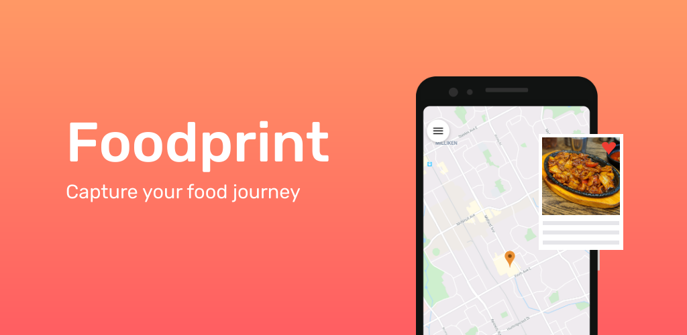
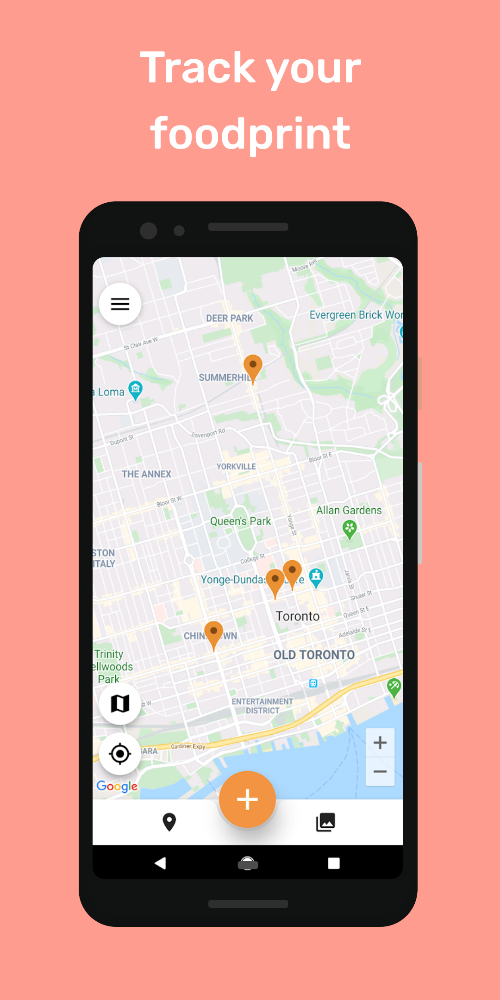
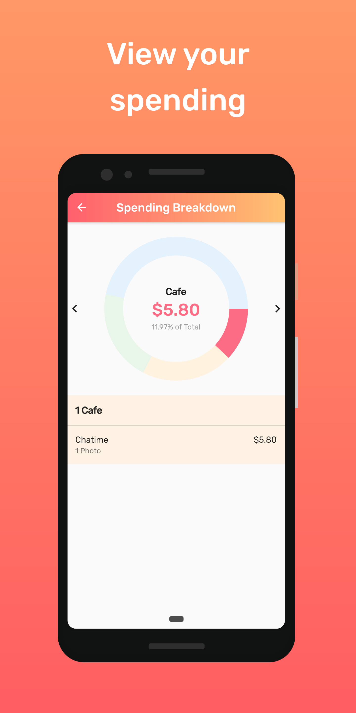

# Foodprint
      
  

**A personal journal for foodies.**  

## Description :page_facing_up:
Foodprint is a mobile application that allows users to capture and track their dining experiences around the world. 

    
    
    

## Features :sparkles:
* A personal map displaying the user's visited dining locations.
* A summary of the user's personal spending, separated by type (restaurant, cafe, bakery, bar). 
* A bug reporting tool using the [bug_report](https://github.com/Puepis/bug_report) package.
* Uses custom authentication and JWT authorization.

## Built With :hammer:
* [Flutter](https://flutter.dev/)

## Author :book:
Designed and built by Philips Xu. 

## Contact :email:
You can contact me at philips.xu1@gmail.com if you have any questions or concerns. To submit a bug within the app, please use the feedback form embedded within the application.

## License :scroll: 
Foodprint is distributed under the [MIT License](LICENSE).

## Credits 
Special thanks to [Kevin Pierce](https://github.com/enigma-01) for designing the app logo and building Foodprint web (currently WIP).
